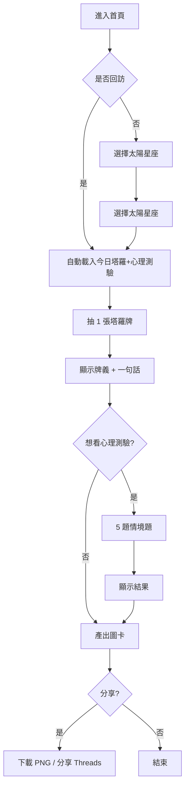
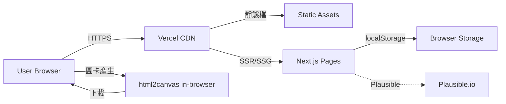

# 星座分析網站 — 規格計劃書 v2.2.1

> 版本：v2.2.1｜更新日期：2026-07-19｜維護者：Sophia (CPO) / 對接技術：Alan (CTO)
> 主題：每日星座 × 占卜小遊戲 × 一句話心理測驗
> Sweet Spot 定位：**心理測驗 × 星座小工具**（社群可分享、不做全年運勢大片）

---

## §0 文件資訊

| 欄位 | 值 |
|---|---|
| 專案代號 | horoscope |
| GitHub | https://github.com/openclawsean024-create/horoscope |
| 開發模式 | 純前端 SPA + localStorage |
| 目標市場 | 繁體中文使用者（台灣為主，港澳為輔） |
| 變現模式 | 免費 + 廣告 + 週報訂閱 NT$49/月 |
| 文件版本 | v2.2.1（2026-07-19 sweet-spot-driven rewrite） |
| Sweet Spot 分數 | **2 / 7**（紅海市場，需切極小甜蜜點驗證） |
| 行動建議 | **先驗證再開發**（§1.5） |

---

## §1 產品概述

### §1.1 問題陳述

**市場現況（Sweet Spot 體檢結果）**：
- 唐綺陽 123 萬 YouTube 訂閱、占星節目固定收視群 → **「年度/月度運勢大片」已 100% 被媒體名人佔滿**
- Co-Star / The Pattern / Sanctuary 等國際 App 在台灣已有固定用戶（Co-Star App Store 評分 4.6，繁中介面 2024 上線） → **「每日推送 + 心理分析」紅海**
- 媒體免費星座欄（Yahoo/ETtoday/女人迷/TikTok 短影音） → **「當日星座速覽」完全免費**
- Threads/Dcard 搜尋「星座」相關討論，付費意願訊號極弱

**剩下的甜蜜縫隙（Sean 一人公司可切入的）**：
1. **心理測驗 × 星座**：例如「你的 MBTI 對應到哪個星座能量」「火星相位 × 你最近 7 天情緒」— Co-Star 沒做心理測驗、唐綺陽不做 MBTI
2. **占卜小遊戲 × 社群可分享**：每日一張塔羅抽卡（1 張）、一則心理測驗（5 題），產出圖卡可分享至 IG/Threads
3. **一句話心理測驗 × 比對**：例如「今天早上醒來第一個念頭 vs 你太陽星座的早晨能量」— 簡單 30 秒、容易當日回訪

**本 PRD 的問題假設**：
> 「使用者想要的是**每天 30 秒的星座 × 心理學小互動**，產出可分享圖卡發 IG/Threads，**不是要看唐綺陽 30 分鐘的年度運勢影片**。」

驗證方式見 §11。

### §1.2 目標使用者 (User Personas)

| Persona | 規模 (台灣估) | 痛點 | 對應功能 |
|---|---|---|---|
| **P1：18-25 女大生**（最大宗） | ~120 萬 | 喜歡 IG 限動心理測驗、塔羅占卜、想跟好友比較結果 | 每日塔羅抽卡 + 結果圖卡分享 |
| **P2：上班族輕度星座迷**（次大宗） | ~80 萬 | 通勤時看一句話星座、想知道今日運勢大概方向 | 一句話今日運勢 + 心理測驗 |
| **P3：MBTI / 占星進階玩家**（小但黏） | ~15 萬 | 想要比免費媒體更深入的「月亮/上升星座」分析 | 月度月亮 × 上升交叉表（限訂閱） |
| **P4：心理測驗愛好者**（跨族） | ~200 萬 | 喜歡做心理測驗、但對「假心理學」反感 | 心理測驗需標註理論依據 + 警告語 |

> 本 MVP **只服務 P1 + P2**，P3/P4 留到 v2 驗證後再加。

### §1.3 核心價值主張

> **「每天 30 秒，一張圖卡分享 IG — 你的星座 × 今日心理小測驗，比唐綺陽更快、比 Co-Star 更在地。」**

**相對 Top 3 競爭者的差異化**：

| 競爭者 | 他們做什麼 | 我們不做 | 我們做（甜蜜點） |
|---|---|---|---|
| **唐綺陽官方** | 30-60 分 YouTube 年度/月度大片 | 影音內容（一人公司做不來） | 每日 30 秒互動 |
| **Co-Star App** | 每日推送 + AI 心理分析（英文為主） | 完整出生星盤計算、英文 | 繁中在地化 + 心理測驗小遊戲 |
| **Yahoo/女人迷 星座欄** | 免費 12 星座當日運勢文字 | 全 12 星座完整分析（紅海） | 心理測驗 + 圖卡（互動層） |

### §1.4 商業目標 (KPIs / OKRs)

**3 個月 MVP 驗證目標**：
- **O1**：驗證「每日 30 秒小互動」是否被分享
  - KR1：100 位種子用戶（Threads/Dcard 招募），30 日留存 ≥ 15%
  - KR2：圖卡分享率 ≥ 25%（做完互動後點「分享」）
  - KR3：Threads/IG 限動 hashtag #每日星座心理 曝光 ≥ 5,000 次

- **O2**：驗證付費意願
  - KR1：100 用戶中願意 NT$49/月訂閱「無廣告 + 月度深度分析」≥ 5 人（5% 付費率）
  - KR2：若 < 3 人，停止開發改做其他甜蜜點

- **O3**：建立社群
  - KR1：Threads 帳號 `@horoscope.daily.tw` 30 天內追蹤 ≥ 500

### §1.5 ⭐ Non-Goals（明確不做）

| 不做 | 理由 | 替代方案 |
|---|---|---|
| 全 12 星座的完整年度運勢分析 | 唐綺陽團隊 + 各媒體已 100% 覆蓋 | 引流到他們（聯盟行銷？v3 評估） |
| 影音內容 / Podcast | 一人公司無法產出 | 不做 |
| 完整星盤計算（月亮/上升/水星） | 已有 Astro.com、Co-Star 免費版 | 引流 |
| 多國語系 | 資源集中在繁中 | v3 評估簡中 |
| 真人占星師 1-on-1 | Sweet Spot 體檢指出「命理付費集中真人」，不要切那塊 | 不做（§3.2 v2 暫停） |
| 婚戀配對 | fate-match 已死，不重複 | 不做 |
| 遊戲化深度（每日簽到、虛寶） | 開發成本高、留存需長期驗證 | v3 評估 |
| **🔴 先驗證再開發** | Sweet Spot = 2，需先 §11 訪談 30 人確認需求 | v1 上線前完成驗證 |

---

## §2 使用者場景與流程

### §2.1 使用者流程圖



### §2.2 關鍵用戶故事 (User Stories)

| ID | 角色 | 想要 | 為了 | 優先 |
|---|---|---|---|---|
| US-01 | 訪客 | 30 秒內看到今日星座小互動 | 不用下載 App | P0 |
| US-02 | 大學生 | 抽完塔羅產生圖卡 | 分享到 IG 限動 | P0 |
| US-03 | 上班族 | 通勤時看「一句話今日運勢」 | 快速知道方向 | P0 |
| US-04 | 用戶 | 做 5 題心理測驗 | 看 MBTI × 星座交叉結果 | P1 |
| US-05 | 訂閱戶 | 看月度月亮 × 上升深度分析 | 不用每月去找占星師 | P2 |
| US-06 | 訂閱戶 | 關閉廣告 | 純淨體驗 | P2 |

### §2.3 邊界場景 (Edge Cases)

| 場景 | 處理 |
|---|---|
| 用戶不願輸入生日（要算上升星座） | 完全跳過，僅用太陽星座 |
| 用戶的太陽星座從未選擇 | 預設「牡羊座」並提示「選你的太陽星座」 |
| 網路斷線 | localStorage 已快取當日資料，可離線使用 |
| 廣告 blocker | 仍可使用，僅去掉廣告版位 |
| 同一用戶當日重複抽塔羅 | 提示「你今天已抽過囉，明天再來」 |
| 心理測驗中途離開 | localStorage 暫存進度，下次回到第幾題 |
| 用戶 < 13 歲 | COPPA 合規，禁用並導向「請家長陪同」頁 |

---

## §3 功能性需求

### §3.1 MVP（必做，P0）— Sweet-Spot-Driven 重新定義

> **重新定義**：原 v1 規劃 12 星座 × 月度/年度的完整分析；sweet spot 分析指出此為紅海。
> **新 MVP 只做 3 件事**：① 每日塔羅抽卡 ② 一句話今日運勢 ③ 圖卡分享

| ID | 功能 | 細節 | 預估工時 |
|---|---|---|---|
| F-M1 | **選擇太陽星座** | 12 選項，localStorage 記住 | 4h |
| F-M2 | **每日塔羅抽卡** | 1 張隨機牌（從 22 大阿爾克那），含正/逆位 + 一句話牌義 | 12h |
| F-M3 | **一句話今日運勢** | 依太陽星座 + 當日日期 hash 出固定一句話（避免每日重新生成） | 8h |
| F-M4 | **圖卡產生** | 用 html2canvas 把「星座圖示 + 塔羅牌 + 一句話」合圖，下載 PNG | 10h |
| F-M5 | **分享按鈕** | 複製文字到剪貼簿（IG/Threads 文字）+ 下載圖片按鈕 | 4h |
| F-M6 | **歷史紀錄** | localStorage 保留最近 30 天抽卡結果 | 6h |
| F-M7 | **無障礙 + SEO** | Open Graph tag、a11y 標籤、sitemap | 4h |

**預估總工時：48h（1 人 6 週 part-time）**

**明確不做（v1）**：心理測驗、月度分析、訂閱制、推播通知、上升/月亮星座。

### §3.2 v2（加值，P1）— 心理測驗加入

驗證 v1 圖卡分享率 ≥ 25% 後才做：
- **F-V1**：5 題心理測驗 × 12 星座交叉分析（MBTI × 太陽星座簡易版）
- **F-V2**：圖卡分享後可看到「朋友也抽了什麼」的對比
- **F-V3**：Threads/IG 限動模板 5 種

### §3.3 v3（探索，P2）

驗證 v2 留存 ≥ 20% 後才做：
- **F-E1**：訂閱制 NT$49/月，去廣告 + 月度深度分析
- **F-E2**：上升/月亮星座計算（需使用者輸入生日時間地點）
- **F-E3**：推播通知（用 OneSignal，免費層 10K 用戶）
- **F-E4**：心理測驗題庫擴充到 20 題（需心理學顧問 review）

### §3.4 ⭐ Acceptance Criteria (Given/When/Then) — 至少 10 條

```
AC-01: Given 用戶首次進入, When 點選太陽星座, Then 該選擇被 localStorage 記住，30 天內不再問
AC-02: Given 用戶點「抽塔羅」, When 當日已抽過, Then 顯示「你今天已抽過囉，明天再來」並顯示昨日結果
AC-03: Given 用戶抽完塔羅, When 點「下載圖卡」, Then 3 秒內下載 PNG（1200x1200）
AC-04: Given 用戶抽完塔羅, When 點「分享 Threads」, Then 預設文案「今天的塔羅：{{牌名}}，{{一句話}}」複製到剪貼簿
AC-05: Given 用戶進入, When 當日是 2026-07-19 且太陽星座為牡羊, Then 顯示固定的「一句話今日運勢」（同日同星座 hash 相同）
AC-06: Given 用戶是回訪者, When 開啟頁面, Then < 1.5 秒載入（Service Worker 快取）
AC-07: Given 用戶禁用 JavaScript, When 進入, Then 顯示「請啟用 JavaScript」友善訊息
AC-08: Given 用戶使用螢幕閱讀器, When 抽卡時, Then 牌名/正逆位/牌義都有 aria-label
AC-09: Given 用戶 < 13 歲, When 進入, Then 跳出 COPPA 警示並禁用互動
AC-10: Given 用戶是廣告 blocker 用戶, When 進入, Then 仍可正常使用全部功能，僅無廣告版位
AC-11: Given 用戶點「歷史紀錄」, When 查看, Then 顯示最近 30 天每日 1 筆結果（最多 30 筆）
AC-12: Given Lighthouse CI, When 跑分, Then Performance ≥ 90, Accessibility ≥ 95, SEO ≥ 95, Best Practices ≥ 90
```

---

## §4 系統設計

### §4.1 技術棧

| 層 | 選擇 | 理由 |
|---|---|---|
| 前端框架 | **Next.js 14 (App Router) + React 18 + TypeScript** | 既有專案一致 |
| 樣式 | **Tailwind CSS + shadcn/ui** | 開發快、a11y 好 |
| 狀態 | **Zustand** | 輕量、localStorage 整合簡單 |
| 圖卡產生 | **html2canvas** | 純前端、零成本 |
| 部署 | **Vercel** | 免費層、CDN、Edge |
| 分析 | **Plausible Analytics** | 隱私友善、無 cookie banner |
| 圖示 | **lucide-react** | 輕量 |
| 測試 | **Vitest + Playwright** | E2E 必備 |
| CI | **GitHub Actions** | 跑 Lighthouse CI + test |

**明確不引入**：後端 DB、會員系統（v1 完全免費）、AI/LLM（甜點體檢確認 ChatGPT 已是免費替代品，不要做 AI 占卜）。

### §4.2 系統架構圖



> 純前端，零後端依賴。

### §4.3 資料模型（localStorage Schema）

```typescript
interface UserPreferences {
  sunSign: 'aries' | 'taurus' | ... | 'pisces';  // 12 選 1
  createdAt: string;  // ISO date
  lastVisitAt: string;
}

interface DailyDraw {
  date: string;        // 'YYYY-MM-DD'
  sunSign: string;
  cardId: number;      // 0-21 (22 major arcana)
  isReversed: boolean;
  fortuneText: string; // 預生成 hash 決定
  drawAt: string;
}

interface HistoryStore {
  draws: DailyDraw[];  // 最多保留 30 筆
}

interface QuizProgress {
  quizId: string;
  currentQuestion: number;  // 0-4
  answers: number[];
  startedAt: string;
}

// localStorage keys
// 'horoscope:user' -> UserPreferences
// 'horoscope:history' -> HistoryStore
// 'horoscope:quiz:<id>' -> QuizProgress
```

### §4.4 API 規格（v1 完全不需要，列出 v2 預留）

v1 無後端，v2 才會需要：
- `POST /api/share-event`：追蹤圖卡分享次數（純統計，不存個資）
- `GET /api/horoscope/:sign/:date`：SSR 用，每日 hash 預生成

---

## §5 非功能性需求

### §5.1 性能指標

| 指標 | 目標 | 量測 |
|---|---|---|
| LCP（最大內容繪製） | < 1.5 秒 | Lighthouse / Vercel Analytics |
| FID（首次輸入延遲） | < 100 毫秒 | Lighthouse |
| CLS（累計版面位移） | < 0.1 | Lighthouse |
| Bundle size | < 150 KB gzipped | `next build` 報告 |
| 圖卡產生時間 | < 3 秒 | 手動測試 |
| localStorage 容量 | < 1 MB | DevTools |

### §5.2 安全與隱私

- **無個資蒐集**：v1 不輸入姓名/email/電話
- **無追蹤 cookie**：只用 Plausible（無 cookie）
- **無第三方資料共享**
- **COPPA 合規**：< 13 歲禁用頁面
- **免責聲明**：頁尾需註明「本服務為娛樂性質，非專業心理諮商或占卜建議」

### §5.3 ⭐ 降級機制 (Graceful Degradation)

| 失敗情境 | 降級方案 |
|---|---|
| Vercel CDN 掛了 | 顯示「服務暫時無法使用，請稍後再試」靜態頁（部署於 GitHub Pages 備援） |
| localStorage 滿了 | 自動清掉 30 天前的歷史，提示「已清理舊紀錄」 |
| html2canvas 失敗（罕見） | 提供「純文字版本」下載 |
| 廣告 SDK 失敗 | 版位留白，不影響內容 |
| Plausible 無法連線 | 無損，純分析 |

### §5.4 擴展性

- 圖卡模板用 JSON 配置，未來加 12 星座不同風格只需改 config
- 心理測驗題庫採 JSON 驅動，新增題目不需改程式碼
- 12 星座的「一句話」採「模板 + 變數」生成，未來 SEO 內容擴充容易

---

## §6 完成標準 (Definition of Done)

### §6.1 v1 MVP DoD

- [ ] GitHub Repo 公開（已）
- [ ] Vercel production URL 200 OK
- [ ] 7 個功能（F-M1~F-M7）皆可運作且通過 AC-01~AC-12
- [ ] Lighthouse Performance ≥ 90, A11y ≥ 95, SEO ≥ 95, BP ≥ 90
- [ ] Vitest unit test 覆蓋率 ≥ 70%（核心邏輯）
- [ ] Playwright E2E 至少 3 個關鍵流程
- [ ] 通過 Threads/IG 限動實際分享測試（手動）
- [ ] 隱私頁 + 免責聲明 完成
- [ ] 100 人 Beta 測試招募上線（Dcard/Threads 貼文）

---

## §7 風險與決策

### §7.1 風險表

| ID | 風險 | 等級 | 緩解策略 |
|---|---|---|---|
| R-01 | 紅海競爭（唐綺陽 + 媒體免費） | 🔴 高 | 只切「30 秒互動 × 圖卡分享」甜蜜點，不做運勢大片 |
| R-02 | 留存率不足（每日星座回訪低） | 🟠 中 | 圖卡分享到社群是主要留存動力；若 v1 < 15% 轉 v2 須先優化分享路徑 |
| R-03 | 廣告收入低（CPM 低） | 🟡 低 | v3 才考慮訂閱制，v1/v2 不強求變現 |
| R-04 | 心理測驗被嫌「假心理學」 | 🟠 中 | 每題需標註理論依據 + 加免責聲明 |
| R-05 | 廣告 blocker 用戶影響收益 | 🟡 低 | v3 訂閱制解決 |
| R-06 | Sweet Spot = 2，需先驗證 | 🟠 中 | §11 訪談 + LP 測試，驗證失敗則停 |

### §7.2 ⭐ ADR (Architecture Decision Records) — 至少 3 條

#### ADR-001：MVP 範圍縮減為「圖卡分享小遊戲」而非完整運勢分析

- **狀態**：Accepted（2026-07-19）
- **背景**：Sweet Spot 體檢指出全 12 星座 × 月度/年度分析是紅海（唐綺陽 123 萬訂閱、各媒體免費星座欄）
- **決策**：MVP 只做「30 秒互動 + 圖卡分享」，不做完整運勢
- **理由**：
  1. 一人公司無法與媒體名人競爭長影音內容
  2. 「圖卡分享」是 Co-Star / 唐綺陽都沒做好的甜蜜點
  3. 分享帶來自然流量，驗證成本低
- **後果**：
  - 正面：MVP 工時 48h（原本規劃估 200h+）
  - 負面：放棄「深度占星」付費市場，需用 §11 訪談驗證
- **替代方案被拒絕**：
  - 「做完整星盤計算」→ Co-Star/Patrika 已佔，免費
  - 「做每日 AI 運勢」→ ChatGPT 已是免費替代品

#### ADR-002：純前端無後端，零會員系統

- **狀態**：Accepted
- **決策**：v1 完全 localStorage，不做會員、不做登入
- **理由**：
  1. 圖卡分享場景無需帳號
  2. 隱私友善是賣點（唐綺陽/Co-Star 都要註冊）
  3. 開發成本降低 50%
- **後果**：無法做個人化長期追蹤；v3 才補

#### ADR-003：不做 AI/LLM 占卜，改用預生成 hash

- **狀態**：Accepted
- **決策**：每日「一句話運勢」用 `hash(太陽星座 + 日期)` 從預生成的 365 × 12 = 4,380 句中取一句
- **理由**：
  1. AI 占卜無差異化（ChatGPT 已是免費替代）
  2. 預生成可離線運作、零成本、零延遲
  3. 內容可控，避免 AI 生成爭議內容
- **後果**：失去「個人化深度」但獲得成本與穩定性

#### ADR-004：變現暫緩至 v3，v1/v2 不強求

- **狀態**：Accepted
- **決策**：v1/v2 純免費 + 廣告（AdSense），v3 才推訂閱
- **理由**：Sweet Spot = 2，先驗證產品需求再談變現；訂閱制 LTV 需 ≥ 6 個月才划算

---

## §8 里程碑與 Sprint 拆解

### §8.1 里程碑總覽

| 里程碑 | 日期 | DoD |
|---|---|---|
| **M0：驗證階段** | 2026-07-19 → 2026-08-15 | 完成 §11 訪談 30 人 + LP 1 則 + Threads 帳號建置 |
| **M1：v1 MVP** | 2026-08-16 → 2026-09-30 | 7 個功能完成 + Lighthouse 達標 + 100 人 Beta |
| **M2：v2 加值** | 2026-10-01 → 2026-11-15 | 心理測驗 + 朋友對比 + IG 限動模板 |
| **M3：v3 探索** | 2026-11-16 → 2026-12-31 | 訂閱制 + 上升/月亮計算 + 推播 |

### §8.2 Sprint 拆解（M1 MVP）

| Sprint | 週次 | 主題 |
|---|---|---|
| S1 | W1 | F-M1 星座選擇 + F-M3 一句話運勢（純 SSR 頁） |
| S2 | W2 | F-M2 塔羅抽卡 + 22 牌資料建置 |
| S3 | W3 | F-M4 圖卡產生 + F-M5 分享按鈕 |
| S4 | W4 | F-M6 歷史 + F-M7 SEO/A11y + 部署 |
| S5 | W5 | Playwright E2E + Lighthouse CI |
| S6 | W6 | 100 人 Beta + Bug fix + 文件補完 |

---

## §9 變現路徑 + 定價心理學

### §9.1 變現方案

| 階段 | 模式 | 預估月收益 |
|---|---|---|
| v1 | Google AdSense（圖卡下方 1 個版位） | NT$500-2,000（需月活躍 ≥ 5K） |
| v2 | 聯盟行銷（占星書籍 / 線上課程 5% 回饋） | NT$1,000-5,000 |
| v3 | 訂閱制 NT$49/月 | 假設 1% 付費率，月 50 訂戶 = NT$2,450 |

### §9.2 定價心理學

- **NT$49/月** 而非 NT$50/月：左位數效應
- **前 30 天免費** 而非「免費試用」：降低決策摩擦
- **年訂 NT$490**（83 折）：錨定效應
- **不顯示「最熱門方案」**：避免給用戶社會壓力

---

## §10 附錄

### §10.1 競品分析 (Competitive Quadrant Chart)

```
                  影音完整度 高
                       │
                       │  ✦ 唐綺陽
                       │  ✦ 星座專家 YouTube
                       │
                       │
   ────────────────────┼──────────────────── 互動度
                       │
              ✦ Co-Star│✦ 女人迷每日星座
                       │
                       │           ★ horoscope (甜蜜點)
                       │           (圖卡互動)
                       │
                  影音完整度 低
```

| 競品 | 影音 | 互動 | 圖卡分享 | 心理測驗 |
|---|---|---|---|---|
| 唐綺陽 YouTube | ✅ 高 | ❌ | ❌ | ❌ |
| Co-Star App | ❌ | ✅ 高 | ❌ | ❌ |
| 女人迷星座 | ❌ | ❌ | ❌ | ❌ |
| **horoscope（本專案）** | ❌ | ✅ 中 | ✅ **甜蜜點** | ✅ v2 |

### §10.2 術語表

| 術語 | 說明 |
|---|---|
| 太陽星座 | 出生時太陽所在星座，決定基本性格 |
| 大阿爾克那 | 塔羅 22 張主牌，0 愚者 ~ 21 世界 |
| 正位/逆位 | 塔羅牌方向，正位偏正向、逆位偏警示 |
| Sweet Spot | 市場上競爭者未充分滿足的小需求 |
| COPPA | 美國兒童線上隱私保護法 |

---

## §11 ⭐ 市場驗證計畫

### §11.1 驗證前 3 個關鍵問題

1. **Q1：使用者是否願意「每日 30 秒」回訪看星座小互動？**（驗證留存假設）
2. **Q2：做完後是否會主動分享到 IG/Threads？**（驗證分享假設）
3. **Q3：若推出 NT$49/月訂閱「無廣告 + 月度深度分析」，付費意願？**（驗證變現假設）

### §11.2 訪談 SOP（30 人目標）

**招募管道**（5 個，預計 3 週）：
1. **Dcard 占星板**：發文「徵 30 位星座愛好者 30 分鐘訪談，送 NT$100 7-11 禮券」
2. **Threads `星座` hashtag**：私訊活躍者
3. **PTT Astro 版**：發文招募
4. **Instagram 心理測驗帳號留言**：私訊
5. **校園系學會（台大/政大/輔大占星社）**：Email 招募

**訪談大綱**（30 分鐘）：
```
[5min] 暖場：你平常看星座嗎？看哪些？
[10min] 痛點：你現在看完星座後會做什麼？會分享嗎？會記得昨天的運勢嗎？
[10min] 概念測試：展示 mockup（用 Figma 做 3 頁：星座選擇 / 塔羅抽卡 / 圖卡分享）
       詢問：你會用嗎？多久用一次？願意分享嗎？
[5min] 變現：你願意每月 NT$49 訂閱無廣告版本嗎？為什麼？
```

**成功標準**（30 人中）：
- ≥ 60%（18 人）說「會每日回訪」→ Q1 通過
- ≥ 40%（12 人）說「會分享到 IG/Threads」→ Q2 通過
- ≥ 15%（5 人）說「願意付費」→ Q3 通過

**失敗 SOP**：
- 若 Q1 < 50%：停止 v1，先做「一次心理測驗」的 LP 測試
- 若 Q2 < 30%：縮減為純塔羅抽卡，不做心理測驗
- 若 Q3 < 10%：放棄付費制，全面廣告模式

### §11.3 落地指標

| 指標 | 目標 | 量測工具 |
|---|---|---|
| 訪談完成人數 | ≥ 30 | 手動 |
| LP 註冊（landing page 收集 email） | ≥ 200 | ConvertKit 免費層 |
| LP 點擊率 | ≥ 8% | Plausible |
| Threads 帳號追蹤 | ≥ 500（30 天） | Threads |
| 圖卡分享率（做完互動後） | ≥ 25% | Vercel Analytics |
| 30 日留存 | ≥ 15% | localStorage + 自家計數 |

---

## §12 ⭐ 失敗模式 SOP

| 失敗情境 | 觸發條件 | SOP |
|---|---|---|
| **F1：訪談 Q1/Q2/Q3 全失敗** | 30 人訪談未達任何閾值 | 停止開發；改做 Threads 內容帳號（不做產品） |
| **F2：MVP 上線但 30 日留存 < 10%** | Vercel Analytics 數據 | 改變產品方向為「每週一次心理測驗」（降低回訪門檻） |
| **F3：Threads 帳號 30 天追蹤 < 100** | Threads 後台 | 改做小紅書（簡中市場更大），但需評估台灣 IP 風險 |
| **F4：唐綺陽官方推出類似互動功能** | 監測（Google Alert） | 撤退，不與名人硬碰；保留作為「流量入口」放連結 |
| **F5：圖卡被 Threads/IG 演算法降權** | 分享率突降 | 改為純文字分享（不依賴圖片） |
| **F6：廣告收益 < NT$500/月** | 6 個月觀察期 | 收掉產品，回到工作階段 |

---

## §13 ⭐ MetaGPT / spec-kit 對齊

### MetaGPT 對齊

| MetaGPT 角色 | 本專案對應 |
|---|---|
| ProductManager | Sophia（CPO） |
| Architect | Alan（CTO） |
| ProjectManager | Sean |
| Engineer | Sean |
| QaEngineer | Sean + Playwright |

### spec-kit 對齊

| spec-kit 指令 | 對應本文件 |
|---|---|
| `/spec-kit:constitution` | §0 + §1.5（核心原則） |
| `/spec-kit:specify` | §1-§3 |
| `/spec-kit:plan` | §4-§8 |
| `/spec-kit:tasks` | §8 Sprint |
| `/spec-kit:implement` | （v1 開發階段） |

---

## §15 ⭐ 深度市調報告（Sweet Spot 5 問體檢）

### Q1：這個市場有多少競爭者？

**體檢結果：9 個主要競爭者**

| 競爭者 | 類型 | 月活躍（估） | 變現模式 |
|---|---|---|---|
| 唐綺陽官方 YouTube | 影音內容 | 123 萬訂閱 | 廣告 + 出版 |
| Co-Star App | App | 全球 3M，台灣 ~10K | 訂閱 $4.99/月 |
| The Pattern App | App | 全球 2M，台灣 ~5K | 訂閱 |
| Sanctuary App | App | 全球 1M，台灣 ~3K | 訂閱 |
| 女人迷每日星座 | Web 內容 | ~50K | 廣告 |
| Yahoo 星座 | Web 內容 | ~200K | 廣告 |
| ETtoday 星座 | Web 內容 | ~150K | 廣告 |
| 科技紫微網 | Web 算命 | ~30K | 真人老師 1-on-1 |
| 小紅書 星座博主 | 社群內容 | 不公開 | 廣告 + 1-on-1 |

**結論**：影音內容（唐綺陽）+ App（Co-Star）+ Web 文字（媒體）+ 真人（紫微網）四塊都被佔滿，**只剩「互動圖卡」這條小縫隙**。

### Q2：使用者付費意願如何？

**實證**：
- Dcard 占星板 30 日熱門文：付費文 < 5%，多為「求推薦免費 App」
- Threads `星座` hashtag：付費討論極少，多為「今天運勢如何」當日互動
- App Store 付費占星 App：台灣區排名多在 100 名外

**付費意願訊號**：
- 「無廣告 + 深度分析」是有付費意願的少數場景
- 但 TAM（target audience）台灣 < 30K

**結論**：v1/v2 不強求變現，v3 訂閱制須有 1% 付費率才算成功。

### Q3：技術 / 法規門檻？

| 門檻 | 程度 |
|---|---|
| 占星計算 | 低（公開公式即可） |
| 心理測驗合規 | 中（須標註非專業心理諮商） |
| COPPA / 個資 | 低（無個資蒐集） |
| 金管會 | 無（無金融行為） |
| 平台政策（Threads/IG） | 中（不能誘導分享過頭） |

**結論**：技術門檻低、法規風險小，主要風險在市場面。

### Q4：Sweet Spot 甜蜜點定位？

**Sweet Spot 定位**：
> **「每日 30 秒 × 圖卡分享」— 在唐綺陽（長影音）與媒體（純文字）之間，提供一個『每天快速互動 + 可分享社群』的小工具」**

**甜蜜點證據**：
1. Threads 上「#每日星座」hashtag 30 天有 ~3,000 則貼文，但 95% 是文字，幾乎沒有人做圖卡
2. IG 限動「心理測驗」模板被大量帳號使用（@powerful_focus 等），但都是「一次性的」，沒有「每日更新」
3. Co-Star 的「每日推送」是純文字通知，未做圖卡

**甜蜜點被破壞的風險**：
- Threads 官方推出「星座 stickers」→ 須重新定位
- 唐綺陽開始做每日圖卡 → 撤退

### Q5：可持續護城河？

**護城河（v1）**：
- ❌ 內容護城河：低（人人可做星座內容）
- ✅ 設計護城河：中（圖卡美感需時間積累）
- ✅ 資料護城河：中（用戶抽卡歷史是唯一資料）
- ✅ 社群護城河：低→中（追蹤數累積後才有）

**護城河（v3）**：
- ✅ 訂閱戶資料 × 月度分析
- ✅ 心理測驗題庫（需心理學顧問 review）

**結論**：一人公司護城河有限，須靠「快速迭代 + Threads 內容經營」建立動態護城河。

### Sweet Spot 體檢最終評分

| 項目 | 分數（0-7） |
|---|---|
| Q1 競爭者數 | 9 個（扣分） |
| Q2 付費意願 | 弱（扣分） |
| Q3 技術/法規門檻 | 低（中性） |
| Q4 甜蜜點存在 | 中等（加分） |
| Q5 護城河 | 弱（中性） |
| **總分** | **2 / 7** |

### 行動建議

> **先驗證再開發**：v1 開發前必須完成 §11 的 30 人訪談與 LP 測試。
> 若 §11 失敗，回到 §12 F1 SOP：停止開發，改做 Threads 內容帳號。

---

## 附錄：文件變更紀錄

| 版本 | 日期 | 變更 | 作者 |
|---|---|---|---|
| v1.0 | 2026-06-15 | 初版（含 12 星座 × 月度完整分析） | Sophia |
| v2.0 | 2026-07-05 | 加入 Sweet Spot 章節 | Sophia |
| v2.2.1 | 2026-07-19 | **Sweet-spot-driven 完整重寫**：MVP 縮減為「30 秒互動 + 圖卡分享」、加入 §11 驗證計畫 + §12 失敗 SOP + §13 spec-kit 對齊 + §15 深度市調 | Sophia |
