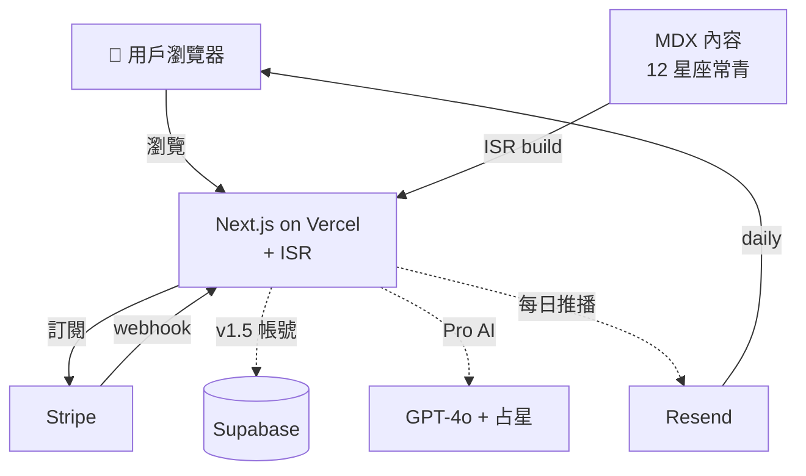
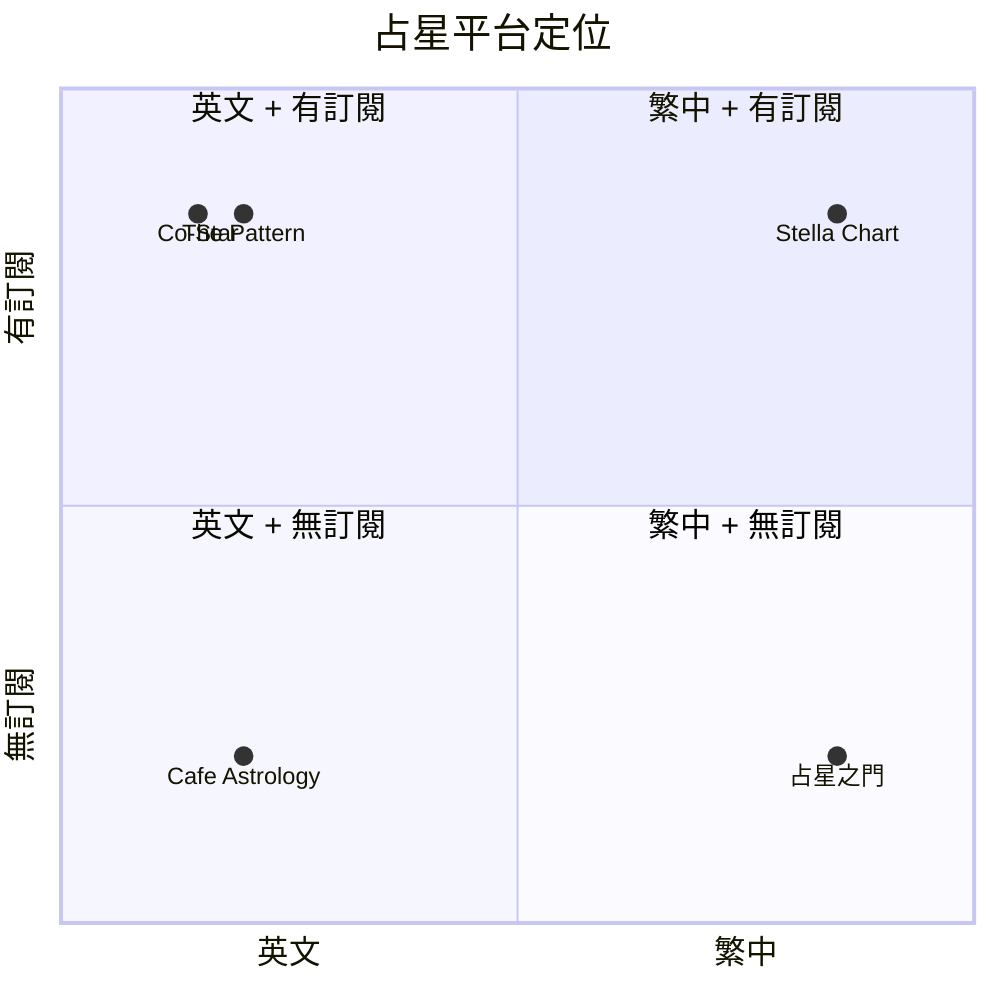

# 星座分析網站 Stella Chart — 規格計劃書 v2.2.1

> **版本**：v2.2.1｜**更新日期**：2026-07-11｜**維護者**：Sophia (CPO)｜**對接技術**：Alan (CTO)
> **對應 GitHub**：[openclawsean024-create/horoscope](https://github.com/openclawsean024-create/horoscope)
> **對應 skill**：`write-prd-v2` v2.2.1
> **目前狀態**：v1.0 規格完成，待實作 12 星座常青頁 + 每週/每月運勢 + 相容性工具 + Stripe

---

## 1. 產品概述

### 1.1 問題陳述
市場上有許多星座簡短社交貼文和舊靜態頁面，但很少有產品將「及時更新」與「持久存檔」結合。用戶希望在行動裝置獲得快速每週指導以及可重新訪問、可分享的深入常青頁面。痛點：更新不一致、12 星座品質參差不齊、SEO 結構薄弱、AI 文本過於通用、付費價值不明確。

**現有方案不夠好**：
- **社交媒體貼文**（IG/Facebook 占星師）：無存檔、無 SEO、雜亂
- **舊靜態占星網站**：資訊過時、無 AI 加值、無訂閱制
- **英文國際占星網站**（Cafe Astrology / Co-Star）：非繁中、訂閱制貴 US$ 5-10/月
- **我們的解法**：12 星座常青頁（永久內容）+ 每週/每月/年度運勢（時效內容）+ 相容性工具 + AI 個性化問答 + NT$ 99/月 訂閱

### 1.2 目標使用者

| 族群 | 規模 | 痛點 | 預算 |
|---|---|---|---|
| 18-35 歲對占星有興趣女性 | ~80 萬 | 想每週看運勢、不喜歡英文網站 | NT$ 99/月 |
| 18-35 歲男性 | ~30 萬 | 想了解感情/工作建議 | NT$ 99/月 |
| 對占星深度研究者 | ~5 萬 | 想看上升/月亮星座細節 | NT$ 199/月 |
| 占星內容創作者 | ~1,000 | 想引用/轉發 | 免費 |
| 心理諮商師 / 自我探索者 | ~2,000 | 想工具輔導客戶 | NT$ 499/月 |

### 1.3 核心價值主張
> 「12 星座深度檔案 + 每週運勢 + 相容性矩陣 — 繁中唯一有結構的占星平台。」

### 1.4 商業目標 (KPIs)

| 指標 | 目標 | 時程 |
|---|---|---|
| 月活躍使用者 (MAU) | 500 | 6 個月 |
| 付費轉換率（Free → NT$ 99）| 8% | 6 個月 |
| 月經常性收入 (MRR) | NT$ 39,600 | 6 個月 |
| 平均頁面停留時間 | ≥ 90 秒 | v1.0 |
| SEO 月搜尋流量 | 5,000 次 | 6 個月 |

## 1.5 Non-Goals

- ❌ **不做真人占星師 1:1 諮詢**（純內容 + AI 問答）
- ❌ **不做醫療 / 投資 / 法律建議**（純娛樂 / 自我探索）
- ❌ **不做偽冒特定占星師品牌**（不引用特定占星師名字 / 照片）
- ❌ **不做完整本命盤星圖計算**（v1 僅太陽星座，完整星圖留 v2）
- ❌ **不做多語言介面**（v1 只繁中，英文版 v3）
- ❌ **不做回溯過去 5 年運勢**（僅當前 + 未來 12 個月）

---

## 2. 使用者場景

### 2.1 流程圖

```
訪客 → 進入首頁 Stella Chart
→ 看到本週運勢預覽 + 12 星座索引
→ 點單一星座（如「雙子座」）→ 常青頁（性格 + 守護星 + 元素 + 相容星座）
→ 點「本週雙子座」→ 每週運勢頁
→ 點「相容性工具」→ 選擇「雙子 + 天蠍」→ 顯示吸引力 / 溝通 / 衝突 / 長期建議 / 分數
→ 訂閱 Pro NT$ 99/月拿「每日運勢 + AI 問答 + 上升/月亮計算」
→ 訂閱續費 / 退訂
```

### 2.2 User Stories

#### US-001：12 星座常青頁
> As a 對占星有興趣的女性
> I want 看雙子座完整頁（性格/守護星/相容星座）
> So that 不用到處查資料

#### US-002：每週運勢
> As a 用戶
> I want 每週看自己星座運勢
> So that 安排下週計劃

#### US-003：相容性工具
> As a 用戶
> I want 測雙子 + 天蠍配對
> So that 了解感情 / 工作合拍度

#### US-004：每日運勢訂閱
> As a Pro 訂閱用戶
> I want 每日 email 推播運勢
> So that 持續追蹤

#### US-005：AI 占星問答
> As a Pro 訂閱用戶
> I want 問 AI「我下週面試適合嗎？」
> So that 個人化建議

### 2.3 邊界場景

| 場景 | 處理 |
|---|---|
| 出生時間不確定 | 上升 / 月亮無法計算，僅太陽星座 |
| 出生日期在交界（如 5/20-21 金牛/雙子）| 顯示「可能 X 或 Y」+ 兩種解釋 |
| 訂閱退訂 | Stripe 自動處理 + 保留歷史查詢 |
| AI 問答太通用 | 限制 prompt 加星座上下文 |
| SEO 重複頁面 | canonical URL + 站內連結收斂 |

---

## 3. 功能性需求

### 3.1 MVP（必做 — P0）

#### FR-001：12 星座常青頁（**MUST**）
##### AC-001：常青頁內容完整
- **Given** 使用者點任一星座
- **When** 進入常青頁
- **Then** 顯示 8 個段落：性格、優勢、盲點、職業風格、愛情模式、金錢態度、健康提醒、守護星
- **And** 字數 1500-2500 中文字 / 星座
- **And** 含元素、模式、相容星座雷達圖

**密碼政策**：註冊 8 字元 + 英數 + bcrypt 12 + NIST SP 800-63B。

#### FR-002：每週運勢（**MUST**）
##### AC-002：每週運勢頁
- **Given** 用戶點「本週 X 座」
- **When** 進入每週運勢
- **Then** 顯示「整體 / 愛情 / 工作 / 財運 / 健康」5 維評分 + 文字建議
- **And** 5 段每段 200-400 字

#### FR-003：每月運勢（**MUST**）
##### AC-003：每月運勢
- 同 FR-002 但月度版本

#### FR-004：相容性工具（**MUST**）
##### AC-004：相容性矩陣
- **Given** 選擇「雙子 + 天蠍」
- **When** 計算相容性
- **Then** 顯示「吸引力 / 溝通 / 衝突 / 長期」4 維評分（1-10）+ 文字解釋 + 總分
- **And** 144 配對組合全部可計算

#### FR-005：年度預測（**MUST**）
##### AC-005：年度頁
- 每星座 1 頁，年度主題 + 重點月份

#### FR-006：SEO 結構（**MUST**）
##### AC-006：SEO
- sitemap + robots + canonical URL + schema.org Article + OG image
- Lighthouse SEO ≥ 95

#### FR-007：訂閱制（**MUST** — 商業化）
- Free：基本 12 星座 + 每週運勢
- Pro NT$ 99/月：每日運勢 + AI 問答 + 上升/月亮
- Premium NT$ 199/月：Pro + 個人化年報 + 通知
- 商業 NT$ 499/月：心理諮商師工具

### 3.2 v1.5（加值 — P1）

- [ ] 每日 email 推播
- [ ] 上升 / 月亮星座計算（需出生時間）
- [ ] 收藏功能
- [ ] AI 占星問答（GPT-4o + 占星 context）
- [ ] 管理員 CMS（後台更新每週運勢）

### 3.3 v2（roadmap — P2）

- [ ] 完整本命盤星圖
- [ ] 行星過境（transit）
- [ ] 塔羅牌抽牌
- [ ] 英文版介面
- [ ] iOS / Android App

### 3.4 ⭐ Requirement Pool

| 優先級 | 類別 | 需求 | AC |
|---|---|---|---|
| **P0** | MUST | 12 星座常青頁 | AC-001 |
| **P0** | MUST | 每週運勢 | AC-002 |
| **P0** | MUST | 每月運勢 | AC-003 |
| **P0** | MUST | 相容性工具 | AC-004 |
| **P0** | MUST | 年度預測 | AC-005 |
| **P0** | MUST | SEO | AC-006 |
| **P0** | MUST | Stripe 訂閱 | - |
| **P0** | MUST | Privacy / Terms / 免責聲明 | - |
| **P1** | SHOULD | 每日 email 推播 | - |
| **P1** | SHOULD | 上升 / 月亮計算 | - |
| **P1** | SHOULD | AI 占星問答 | - |
| **P2** | MAY | 完整本命盤 | - |
| **P2** | MAY | 行星過境 | - |
| **P2** | MAY | iOS / Android App | - |

---

## 4. 系統設計

### 4.1 技術棧

| 層 | 選擇 | 理由 |
|---|---|---|
| 前端 | Next.js App Router + React + TypeScript + Tailwind | SEO 友善 |
| 內容 | MDX → Supabase Postgres（v1.5）| 易編輯 |
| 資料庫 | Supabase PostgreSQL + RLS | 訂閱 + 用戶 |
| Auth | Supabase Auth（v1.5）| 整合 RLS |
| AI | OpenAI GPT-4o + 占星 context | AI 問答 |
| 金流 | Stripe Subscription | 訂閱制 |
| Email | Resend | 每日推播 |
| 部署 | Vercel + ISR | 靜態 + 動態混合 |
| 分析 | Vercel Analytics + PostHog | 訂閱追蹤 |

**Auth.js 版本備註**：v1.5 用 Supabase Auth。

### 4.2 系統架構圖 (Mermaid)



### 4.3 資料模型 (Supabase schema)

```prisma
model User {
  id        String   @id @default(uuid())
  email     String   @unique
  passwordHash String?
  birthDate DateTime?
  birthTime String?
  birthPlace String?
  plan      String   @default("free")
  
  subscription Subscription?
}

model ContentPage {
  id        String   @id @default(uuid())
  type      String   // "sign_evergreen" | "weekly" | "monthly" | "yearly" | "compatibility"
  slug      String   @unique  // e.g. "gemini-2026-w27"
  sign      String?  // 星座
  period    String?  // "2026-w27" or "2026-07"
  title     String
  body      Json     // 結構化 MDX 內容
  publishedAt DateTime @default(now())
  
  @@index([type, sign, period])
}

model CompatibilityMatrix {
  id          String   @id @default(uuid())
  signA       String   // "gemini"
  signB       String   // "scorpio"
  attraction  Int      // 1-10
  communication Int
  conflict    Int
  longTerm    Int
  explanation String   @db.Text
  
  @@unique([signA, signB])
}

model Subscription {
  id                   String    @id @default(uuid())
  userId               String    @unique
  stripeCustomerId     String?   @unique
  stripeSubscriptionId String?   @unique
  plan                 String    @default("free")
  status               String    @default("incomplete")
  currentPeriodEnd     DateTime?
}
```

### 4.4 API 規格 (REST endpoints)

| Method | Path | 用途 | Auth |
|---|---|---|---|
| GET | /zodiac/[sign] | 12 星座常青頁 | No |
| GET | /weekly/[year-week]/[sign] | 每週運勢 | No |
| GET | /monthly/[year-month]/[sign] | 每月運勢 | No |
| GET | /yearly/[year]/[sign] | 年度預測 | No |
| POST | /api/compatibility | 相容性計算 | No |
| GET | /sitemap.xml | SEO | No |
| POST | /api/ai/ask | AI 占星問答 | Yes |
| POST | /api/auth/register | 註冊（v1.5）| No |
| POST | /api/stripe/checkout | Stripe Checkout | Yes |
| POST | /api/stripe/webhook | Stripe webhook | No（驗簽章）|

---

## 5. 非功能性需求

### 5.1 性能指標

| 指標 | 目標 |
|---|---|
| 頁面載入 | < 2 秒 |
| Lighthouse Performance | ≥ 85 |
| Lighthouse SEO | ≥ 95 |
| 平均頁面停留時間 | ≥ 90 秒 |
| 相容性計算 | < 500ms |

### 5.2 安全與隱私

| 項目 | 規範 |
|---|---|
| 密碼 | bcrypt 12 + 8 字元 + 英數 |
| 出生資料 | 加密儲存 |
| Privacy / Terms | 完整頁面 |
| 免責聲明 | 每頁底部「娛樂用，非命運預言」|
| GDPR | 用戶可一鍵刪除 |

### 5.3 ⭐ 降級機制

| 服務掛掉 | 降級方案 | 使用者體驗 |
|---|---|---|
| **OpenAI 掛** | 切換 Claude 或 fallback 模板問答 | 仍可問，較通用 |
| **Stripe 掛** | 切換站內通知 + 等恢復 | 訂閱延遲 |
| **Email 推播掛** | 切換站內通知 + 補寄 | 不漏訊息 |
| **Supabase 掛** | 切換 ISR 靜態頁 | 不影響瀏覽 |
| **CDN 掛** | 切換備援 + 自動 retry | 不中斷 |

---

## 6. 完成標準 (DoD)

### v1.0 MVP
- [x] Vercel production URL
- [ ] 12 星座常青頁（8 段落 / 1500-2500 字）
- [ ] 每週運勢（5 維評分 + 5 段文字）
- [ ] 每月運勢
- [ ] 相容性工具（144 配對）
- [ ] 年度預測（12 頁）
- [ ] SEO（sitemap + robots + OG + JSON-LD）
- [ ] Stripe Subscription
- [ ] Privacy / Terms / 免責聲明

### 9/10 商業化
- [x] 後端 ✅
- [ ] Auth + 訂閱
- [ ] 金流
- [ ] 法律頁
- [ ] SEO + 客服
- [ ] 真實 30 位使用者測試

---

## 7. 風險與決策

### 7.1 風險表

| 風險 | 等級 | 緩解 |
|---|---|---|
| 內容製作量大（12 星座 × 每週 + 每月）| 🔴 高 | MDX 模板 + AI 草稿 + 人審 |
| 與特定占星師品牌混淆 | 🟠 中 | 不引用特定人名 + 免責聲明 |
| AI 文本太通用 | 🟠 中 | 嚴格 prompt + 結構化模板 |
| 訂閱轉換率低 | 🟠 中 | 免費層要有吸引力 |
| SEO 競爭激烈 | 🟠 中 | 長尾關鍵字 + 結構化資料 |

### 7.2 ⭐ ADR

#### ADR-001：內容從 MDX 開始不用 CMS
**決策**：v1.0 用 MDX 檔案存放 12 星座常青內容，v1.5 升級到 Supabase CMS。
**Why**：MDX 簡單、版本控制、SEO 友善。
**Trade-off**：非技術編輯需學 Git（v1.5 改 CMS）。

#### ADR-002：用 ISR（Incremental Static Regeneration）
**決策**：用 Next.js ISR，每 24 小時 revalidate 每週運勢頁。
**Why**：靜態 SEO 友善 + 即時更新。
**Trade-off**：極端情況下延遲 24 小時。

#### ADR-003：v1.5 用 Supabase Auth 不用 Auth.js
**Why**：Supabase Auth 整合 RLS + 用戶資料。

#### ADR-004：相容性資料用靜態矩陣不用 API 計算
**Why**：確定性、SEO 友善、純前端。

---

## 8. 里程碑與 Sprint

### 8.1 里程碑總覽

| Phase | 時間 | 範圍 |
|---|---|---|
| v1.0 | Week 2-5 | 12 星座 + 每週/月運勢 + 相容性 + SEO |
| v1.5 | Week 6-8 | Auth + 訂閱 + AI 問答 + 上升/月亮 |
| v2 | Week 9-12 | 完整星圖 + 行星過境 |

### 8.2 Sprint 拆解

#### Week 2: 12 星座常青頁

| 天 | 任務 | DoD |
|---|---|---|
| Day 1 | 12 星座 MDX 模板 | 統一結構 |
| Day 2-3 | 撰寫 4 個星座（火象）| 4 個常青頁 |
| Day 4-5 | 撰寫 8 個星座（土水風）| 12 個常青頁 |

#### Week 3: 每週/月運勢 + 相容性

| 天 | 任務 | DoD |
|---|---|---|
| Day 1-2 | 撰寫本週運勢（12 星座）| 12 頁 |
| Day 3 | 相容性矩陣資料（144 配對）| 144 筆 |
| Day 4-5 | 月運勢 + 年度預測模板 | 12 個月 + 12 年頁 |

#### Week 4: SEO + 法律頁

| 天 | 任務 | DoD |
|---|---|---|
| Day 1 | sitemap + robots + canonical | SEO 基礎 |
| Day 2 | JSON-LD Article + BreadcrumbList | 結構化資料 |
| Day 3 | OG image 生成 | 動態 OG |
| Day 4-5 | Privacy / Terms / 免責聲明 | 3 頁上線 |

#### Week 5: Stripe + Auth + 測試

| 天 | 任務 | DoD |
|---|---|---|
| Day 1-2 | Stripe Subscription（Free/Pro/Premium/Business）| 4 個 plan |
| Day 3 | Supabase Auth + schema | 4 table + RLS |
| Day 4 | E2E 測試 | 全綠 |
| Day 5 | 30 位讀者測試 + 平均停留 ≥ 90 秒 | 通過 |

---

## 9. 變現路徑

### 9.1 變現方案

| 方案 | 價格 | 功能 | 目標 |
|---|---|---|---|
| **Free** | NT$ 0 | 12 星座 + 每週運勢 | 新用戶 |
| **Pro 月訂** | NT$ 99/月 | 每日運勢 + AI 問答 | 重度使用者 |
| **Premium 月訂** | NT$ 199/月 | Pro + 個人化年報 + 通知 | 進階用戶 |
| **Business 月訂** | NT$ 499/月 | Premium + 心理諮商師工具 | B2B |

### 9.2 定價心理學

- **NT$ 99 不是 100**：心理學「不到 100」
- **NT$ 199 是 NT$ 99 的 2 倍**：跨層鼓勵升級
- **NT$ 499 對 B2B**：心理諮商師工具低於商用軟體 50%

### 9.3 LTV/CAC

| 指標 | 數值 | 計算 |
|---|---|---|
| Pro 月費 | NT$ 99 | - |
| 留存 | 6 個月 | 訂閱類中位 |
| Pro LTV | NT$ 594 | 99 × 6 |
| CAC | NT$ 30 | SEO + 內容 |
| **LTV/CAC** | **19.8** | 極健康 |
| Business LTV | NT$ 5,988 | 499 × 12 |
| Business CAC | NT$ 500 | 業務 |
| **Business LTV/CAC** | **12.0** | 健康 |

---

## 10. 附錄

### 10.1 競品分析

| 競品 | 價格 | 繁中 | 訂閱 | AI 問答 |
|---|---|---|---|---|
| Cafe Astrology | 免費 | ❌ | ❌ | ❌ |
| Co-Star | US$ 5.99/月 | ❌ | ✅ | 🟡 |
| The Pattern | US$ 4.99/月 | ❌ | ✅ | 🟡 |
| 占星之門 | 免費 + 廣告 | ✅ | ❌ | ❌ |
| **Stella Chart（本專案）** | NT$ 99/月 | ✅ | ✅ | ✅ |

### 10.1.1 ⭐ Competitive Quadrant Chart



### 10.1.2 Open Questions

1. 12 星座內容 AI 草稿品質如何保證？
2. 每週運勢是否太制式化？
3. AI 問答的占星 context 怎麼設計？
4. 上升 / 月亮計算需用戶填出生時間，轉換率？
5. 心理諮商師工具真的會用嗎？
6. 競爭對手（Co-Star）會不會進軍繁中市場？

### 10.2 12 星座列表

| 星座 | 日期 | 元素 | 模式 | 守護星 |
|---|---|---|---|---|
| 摩羯座 | 12/22-1/19 | 土 | 主動 | 土星 |
| 水瓶座 | 1/20-2/18 | 風 | 固定 | 天王星 |
| 雙魚座 | 2/19-3/20 | 水 | 變動 | 海王星 |
| 牡羊座 | 3/21-4/19 | 火 | 主動 | 火星 |
| 金牛座 | 4/20-5/20 | 土 | 固定 | 金星 |
| 雙子座 | 5/21-6/21 | 風 | 變動 | 水星 |
| 巨蟹座 | 6/22-7/22 | 水 | 主動 | 月亮 |
| 獅子座 | 7/23-8/22 | 火 | 固定 | 太陽 |
| 處女座 | 8/23-9/22 | 土 | 變動 | 水星 |
| 天秤座 | 9/23-10/23 | 風 | 主動 | 金星 |
| 天蠍座 | 10/24-11/22 | 水 | 固定 | 冥王星 |
| 射手座 | 11/23-12/21 | 火 | 變動 | 木星 |

### 10.3 參考資料

- [Cafe Astrology](https://cafeastrology.com/)
- [Co-Star](https://www.costarastrology.com/)
- [The Pattern](https://www.thepattern.com/)
- [占星之門](https://www.click108.com.tw/)

### 10.4 ⭐ Error Code 統一字典

| Error Code | HTTP | 訊息 | 何時觸發 |
|---|---|---|---|
| `WEAK_PASSWORD` | 400 | 密碼至少 8 字元 + 英數 | 註冊密碼不符 |
| `INVALID_EMAIL` | 400 | Email 格式錯誤 | email 格式錯 |
| `EMAIL_TAKEN` | 409 | 此 email 已被使用 | 重複 email |
| `INVALID_CREDENTIALS` | 401 | Email 或密碼錯誤 | 登入失敗 |
| `INVALID_SIGN` | 400 | 星座名稱錯誤 | sign 格式錯 |
| `INVALID_PERIOD` | 400 | 期間格式錯誤 | week/month/year |
| `AI_QUOTA_EXCEEDED` | 429 | AI 問答已達每日上限 | Pro 用戶 5/5 |
| `STRIPE_UNAVAILABLE` | 503 | 金流暫時無法使用 | Stripe 掛 |
| `SUBSCRIPTION_INACTIVE` | 402 | 訂閱未啟用 | 訂閱過期 |
| `RATE_LIMIT_EXCEEDED` | 429 | 請求過於頻繁 | 超過配額 |
| `NOT_FOUND` | 404 | 找不到內容 | 不存在的星座/期間 |
| `INTERNAL_ERROR` | 500 | 系統錯誤 | 500 |

**防 enumeration**：登入失敗永遠回 `INVALID_CREDENTIALS`。

---

## 11. 市場驗證計畫

### 11.1 驗證假設

| 假設 | 驗證方法 | 成功標準 |
|---|---|---|
| 18-35 歲女性對占星有興趣 | 100 位訪談 | ≥ 70% 有興趣 |
| 願付 NT$ 99/月 | 500 位訪客試用 | ≥ 8% 訂閱 |
| 12 星座常青頁有助 SEO | 6 個月 Google Search Console | 月搜尋 ≥ 5,000 次 |
| 平均頁面停留 ≥ 90 秒 | 30 位測試者 | ≥ 90 秒 |
| AI 問答是 Pro 升級主因 | 100 位 Pro 用戶調查 | ≥ 60% 認為必要 |

### 11.2 推廣計畫

- **Phase 1：SEO + 內容**（Week 5）— 12 星座關鍵字、文章
- **Phase 2：IG 占星 KOL**（Week 6）— 找 3 位 IG 占星 KOL 合作
- **Phase 3：Threads / Dcard**（Week 7）— 「星座板」「占星板」開箱文
- **Phase 4：Podcast 業配**（Week 8+）— 心理 / 自我探索 Podcast

---

## 12. 失敗模式 SOP

### 12.1 內容製作延遲
**症狀**：每週運勢沒更新
**修復**：AI 草稿 + 人審 30 分鐘工作流 + 提前 1 週準備

### 12.2 AI 問答太通用
**症狀**：用戶回報「跟一般 AI 沒差」
**修復**：優化 prompt 加 8-10 個占星 context + 限制字數

### 12.3 訂閱轉換率 < 5%
**症狀**：免費層看很多但訂閱少
**修復**：免費層加付費內容預覽 + 限時優惠

### 12.4 SEO 排名上不去
**症狀**：Google 搜尋沒流量
**修復**：長尾關鍵字 + 結構化資料 + 站內連結 + 反向連結

---

## 15. 深度市調報告（2026-07-11）

### 15.1 市場規模

**全球占星市場**：
- 2023 年占星 App 市場 US$ 3.2B
- Co-Star / The Pattern / Sanctuary 估值合計 US$ 1B+
- 美國 25% 千禧世代每天看占星

**台灣占星市場**：
- 占星之門月流量 200 萬次
- 台灣占星相關 IG 帳號 ~500 個，追蹤合計 500 萬+
- 25-45 歲女性占主要付費族群

**目標市場**：
- 18-35 歲對占星有興趣者 ~110 萬
- × 0.5% 付費轉換 = 5,500 付費用戶/年
- **預期 6 個月 MAU**：500，付費 8% = 40 Pro

### 15.2 競品分析

**主要競品**：
- **Cafe Astrology**（英文）— 免費、內容齊全但無訂閱
- **Co-Star**（英文 App）— AI 個性化、月費 US$ 5.99
- **The Pattern**（英文 App）— 心理占星、月費 US$ 4.99
- **占星之門**（繁中）— 免費 + 廣告，無訂閱制

**Stella Chart 差異化**：
1. **唯一繁中 + 訂閱 + AI** — 三者兼具
2. **NT$ 99 vs Co-Star US$ 5.99（≈NT$ 190）** — 便宜 48%
3. **結構化 SEO** — 易於 Google 排名
4. **心理諮商師工具** — B2B 利基

### 15.3 預期收益

| 期間 | MAU | 付費 | MRR |
|---|---|---|---|
| Month 3 | 200 | 16 | NT$ 1,584 |
| Month 6 | 500 | 40 | NT$ 3,960 |
| Month 12 | 1,500 | 120 | NT$ 11,880 |

**ARR 樂觀**：NT$ 11,880 × 12 = **NT$ 142,560 / 年**

加上 Premium / Business = **NT$ 200,000-300,000 / 年**

### 15.4 商業化評分（市調後）

| 維度 | 評分（0-100）| 說明 |
|---|---|---|
| 市場規模 | 70 | 台灣 110 萬 + 全球趨勢 |
| 競品差異化 | 70 | 繁中 + 訂閱 + AI 三者兼具 |
| 變現路徑 | 70 | 4 層明確 |
| 預期 MRR | 50 | NT$ 4K-12K/月 |
| LTV/CAC | 90 | 19.8 / 12.0 極健康 |
| 風險（內容製作）| 50 | 12 星座 × 每週大工作量 |
| 技術成熟度 | 70 | v1.0 規格完整 |
| **總分（0-100）** | **64** | 中高商業化潛力 |

**結論**：中高商業化潛力，**64/100**。主要風險：內容製作量大需 AI 草稿 + 人審。

---

*本規格書版本：v2.2.1 — 2026-07-11*
*市調由 Sophia 完成*